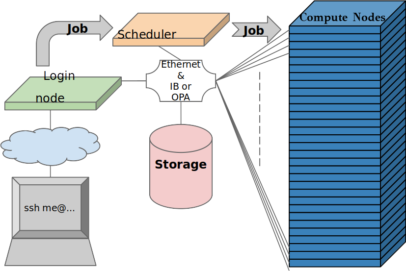

# Connect to Béluga

Béluga is the main Compute Québec Super Computer and is one of the Computer Canada Federation HPC sytem along with Cedar, Graham and Niagara. You can find more information about these systems and documentation about how to use them on the [Compute Canada Wiki page](https://docs.computecanada.ca/wiki/Compute_Canada_Documentation)

If you do not already have a Compute Canada account, you can use the username and password provided to you at the beginning of this lesson.  

~~~
ssh -l <USER_NAME> beluga.calculcanada.ca
~~~
{: .bash}

You are now have a session on one of Béluga login node. It should look something like this:

~~~
###############################################################################
  _       __ _                   
 | |__   /_/| |_   _  __ _  __ _   Bienvenue sur Béluga / Welcome to Béluga
 | '_ \ / _ \ | | | |/ _` |/ _` |    
 | |_) |  __/ | |_| | (_| | (_| |  Aide/Support:    support@calculcanada.ca
 |_.__/ \___|_|\__,_|\__, |\__,_|  Globus endpoint: computecanada#beluga-dtn
                     |___/         Documentation:   docs.calculcanada.ca

###############################################################################
2019-00-00 Annonces en français
2019-00-00 Information to the public in English
[poq@beluga4 ~]$
~~~
{: .bash}

# The File system

There are more then one file systems mounted on Compute Canada Cluster.

~~~
/home
/project
/scratch
/localscratch
~~~

# Installed software

You can see all software installed with the `module` command. To get a list of all software package, type `module avail`, type `module spider <string>` search if a module exist or to get information about a it.

> ## Challenge
>
> Which versions of `fastqc` are installed on CC systems?
>
>> ## Solution
>>~~~
>> module spider fastqc  
>>   Versions:
>>   fastqc/0.11.5  
>>   fastqc/0.11.8
>>~~~
>> {: .bash}  
> {: .solution}
{: .challenge}

# The SLURM Scheduler

You are note supposed to run code on the login nodes. There are hundreds of compute node that are there to do that. The access to these node is taken cared of by a scheduler. All Compute Canada systems are using the [SLURM scheduler](https://www.schedmd.com).

Right now there are hundreds runing on the compute nodes, while more are waiting in queue to be executed. The `squeue` command lets you see all these jobs.

To send you own job in the queue, you can use the `sbatch` command. This command will

# Run you first script on a Super computer

Use nano to create the following script:

~~~
#!/bin/bash
echo Hello from $HOSTNAME
T=5
echo sleeping $T seconds
sleep $T
~~~
{: .bash}

Than make that file executable:

~~~
chmod 755
~~~
{: .bash}

> ##  Exercise
>
> 1 Run the script on the login node, what is the output?  
> 2 Use the `sbatch` command to resubmit the script.  
>   - What job ID where you given?  
> 3 Look at the status of you job using `squeue -u $USER`.  
>   - What other `squeue` option can you use to get information about that specific job?      
>
> 4 Where is the output of your job stored?  
>   - What is its content?  
>
>> ## Solution
>> Heille! Fais-tu frette, on est tu ben dans un coton ouaté
> {: .solution}
{: .challenge}
